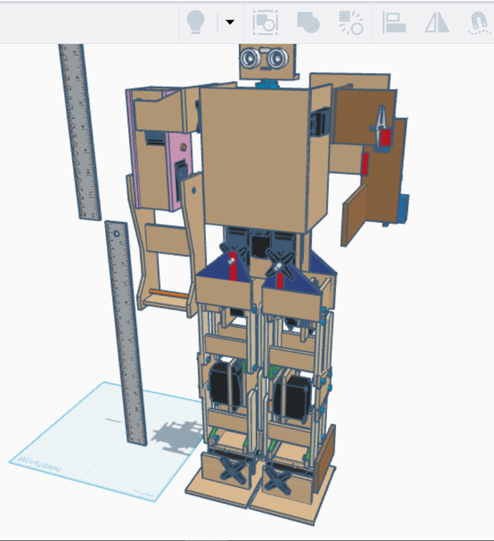
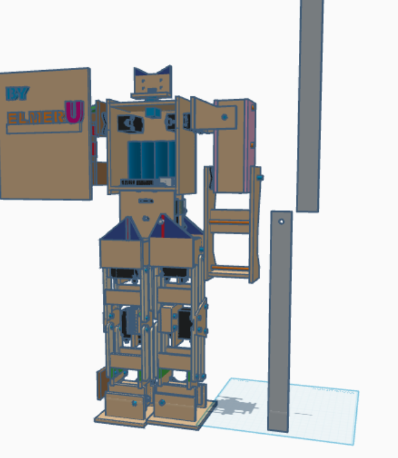

# Humanoid Bipedal Robot


**A professional Humanoid Bipedal Robot controlled via IR remote, featuring 15 degrees of freedom and intelligent obstacle avoidance.**

---

## 📸 Visuals

<p align="center">
  
  
</p>

<p align="center">
  <video src="humanoid-vid1.MOV" width="45%" controls></video>
  <video src="humanoid-vid2.MOV" width="45%" controls></video>
</p>

---

## ✨ Features
- **15 Servo Articulation**: For complex bipedal movements and expressive gestures.
- **IR Remote Control**: Seamlessly switch between 16 different movement modes.
- **Autonomous Obstacle Avoidance**: Integrated HC-SR04 ultrasonic sensor for pathfinding.
- **Non-Blocking Logic**: Implementation of `millis()` for fluid, simultaneous multi-servo coordination.

---

## 🛠 Tech Stack
- **Microcontroller**: Arduino Micro
- **Actuators**: 15x High-Torque Servos
- **Communication**: IR Receiver (DIYables Protocol)
- **Sensors**: HC-SR04 Ultrasonic Distance Sensor
- **Power**: 220V AC to 5V DC Industrial Supply (40A)

---

## 🧠 Challenges & Solutions

### 🏗 Movement & Calibration
**Challenge**: Calibrating 15 servos to achieve stable bipedal walking was extremely difficult. The robot's balance depends on precise synchronization of multiple joints.
**Status**: While the robot is functional, it is still a work-in-progress. I am constantly refining the gait patterns to achieve "perfect" stability.

### ⚡ Power Supply Issues
**Challenge**: I initially struggled with insufficient power. Standard batteries or low-current adapters couldn't supply enough current to all 15 servos simultaneously, causing them to stall, shake, or fail to lift the robot's weight.
**Solution**: Switched to a robust **220V AC to 5V DC (40A)** power supply. This provides more than enough current (40 Amperes) to drive all actuators at peak torque without voltage drops.

---

## 🚀 Getting Started

### Prerequisites
- [Arduino IDE](https://www.arduino.cc/en/software)
- Libraries:
    - `Servo.h` (Standard)
    - [DIYables_IRcontroller](https://github.com/DIYables/DIYables_IRcontroller)

### Installation
1. Clone the repository:
   ```bash
   git clone https://github.com/ELMER369-code/Humanoid-Bipedal-Robot.git
   ```
2. Open `final-micro-no-detached.ino` in Arduino IDE.
3. Connect your Arduino Micro.
4. Select the correct Port and Board in `Tools`.
5. Click **Upload**.

---

## 🎮 IR Remote Mapping

| Key | Action |
|-----|--------|
| **0** | Emergency Stop / Center Servos |
| **1** | Auto-Walk (with Obstacle Avoidance) |
| **UP** | Forward |
| **DOWN**| Backward |
| **LEFT**| Turn Left |
| **RIGHT**| Turn Right |
| **OK** | Neutral Pose |

---

## 📜 License
This project is licensed under the MIT License - see the [LICENSE](LICENSE) file for details.
